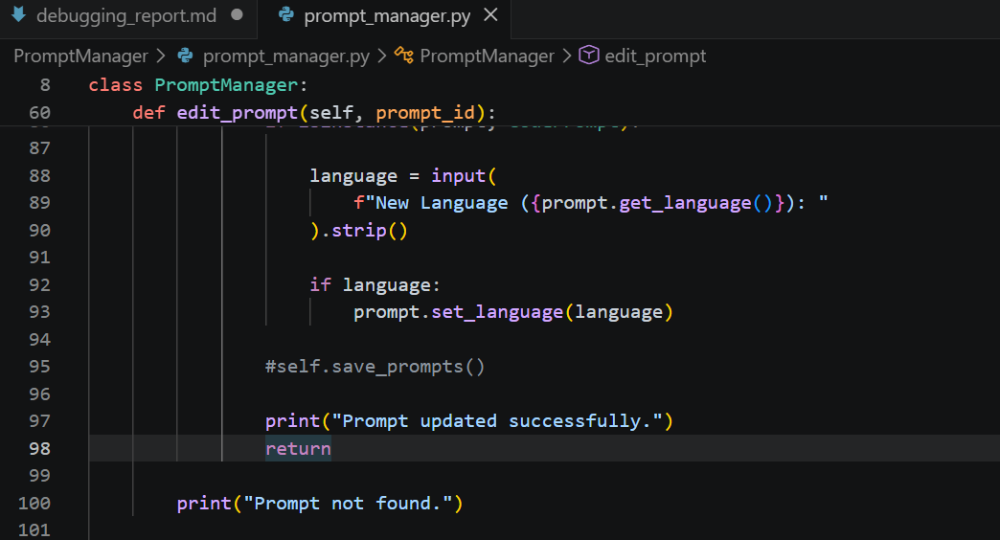
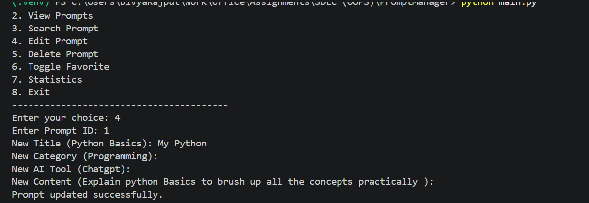
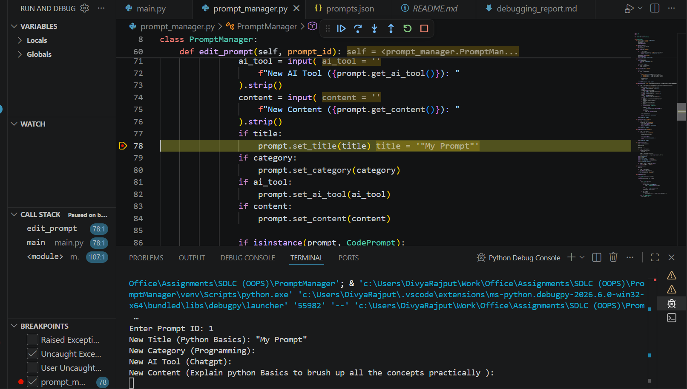
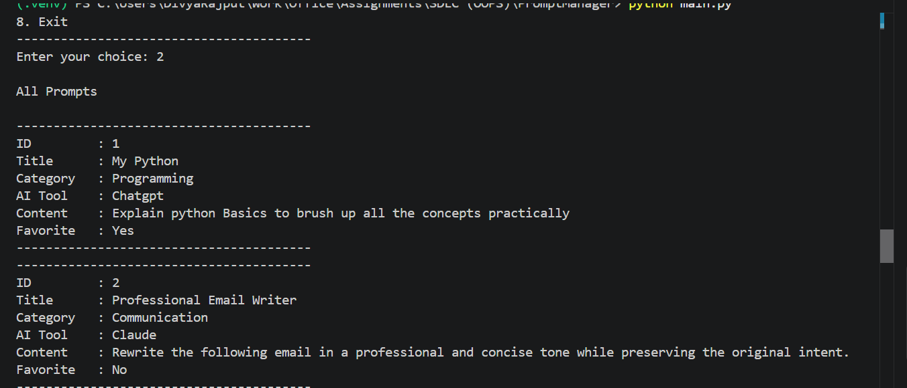

# Debugging Report

## Project Name

PromptVault - AI Prompt Manager

---

## Bug Description

An intentional bug was introduced in the `edit_prompt()` method by commenting out the following line:

```python
# self.save_prompts()
```

This prevented the edited prompt from being saved to `prompts.json`.

---

## Expected Result

After editing a prompt, the updated details should be saved in `prompts.json` and should still be available after restarting the application.

---

## Actual Result

The prompt appeared to be updated while the application was running, but after restarting the application, the changes were lost.

---

## Root Cause

The `save_prompts()` method was not called after updating the prompt.

Since the updated data was not written to `prompts.json`, the changes existed only in memory and were lost when the application was closed.

---

## Debugging Tool Used

- Visual Studio Code
- Python Debugger
- Breakpoints
- Step Over (F10)

---

## Debugging Steps

1. Ran the application using `python main.py`.
2. Edited an existing prompt.
3. Closed and restarted the application.
4. Observed that the edited data was not saved.
5. Opened `prompt_manager.py`.
6. Added a breakpoint inside the `edit_prompt()` method.
7. Started debugging using **F5**.
8. Used **F10 (Step Over)** to execute the code line by line.
9. Found that `self.save_prompts()` was commented out.
10. Uncommented the line.
11. Ran the application again.
12. Verified that the edited prompt was now saved correctly.

---

## Screenshots

### Screenshot 1 - Breakpoint Added

Breakpoint placed inside the `edit_prompt()` method.



---

### Screenshot 2 - Debugger Running

Debugger paused at the breakpoint showing the current execution and variables.



---

### Screenshot 3 - Root Cause

`self.save_prompts()` was commented out, so the updated data was not saved.



---


Uncommented `self.save_prompts()` to save the updated prompt.

---

### Screenshot 5 - Verification

After restarting the application, the edited prompt remained updated, confirming the issue was fixed.



---

## Final Fix

Restored the following line in the `edit_prompt()` method:

```python
self.save_prompts()
```

This writes the updated prompt information to `prompts.json`, ensuring the changes are saved permanently.